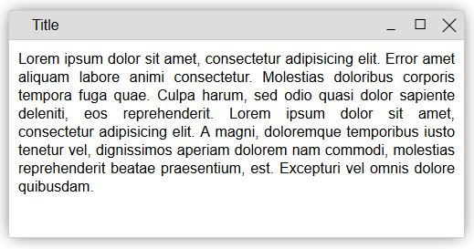

# WindowJS

WindowJS is a simple JavaScript library, to display a functional window inside of the browser.

**Demo:** https://m.thalmann.bz.it/prod/windowjs/demo.html

## Navigation
- [Installation](#installation)
- [Usage](#usage)
- [Documentation](#documentation)
  - [Window](#window)
  - [WindowState](#windowstate)
  - [WindowUtil](#windowutil)
  - [Events](#events)
  - [Options](#options)
- [Example](#example)

## Installation
1. Download the .zip-File and put it in your project-folder.

2. Add this script-tag to the head of the file
```html
<script src="path/to/js/file.js"></script>
```

3. Add this link-tag to the head of the file, to include the styles

```html
<link rel="stylesheet" href="path/to/css/file.css" />
```

4. Start using the library!

## Usage
### Create new window
```javascript
var win = new Window("Awesome title");
```
**NOTE:** Don't use window as variable name, because the window object already exists!

### Add content to the window
```javascript
win.content.innerHTML = 'Lorem ipsum dolor sit amet, consectetur ...';
```
## Documentation
### Window
It's the main object to display the window
#### Instanciating
```javascript
new Window(title, options);
```
- **title** (String): This string is used as the title of the window
- **options** (object): A object with options for the window (see [below](#options)) **(optional)**

After instanciating the window is reloaded and shown (if not defined otherwise)

#### Methods
```javascript
win.reload();                        // Renders the window (you don't have to use this)

win.setTitle(title);                 // Resets the title (string)
win.getTitle();                      // Returns the current title

win.getContainer();                  // Returns the container of the window

win.changeOption(option, value);     // Changes one option (string, object)
win.getOptions();                    // Returns the options

win.changeState(state);              // Sets the current state of the window: NORMAL / MAXIMIZED  (WindowState)
win.getState();                      // Returns the current state of the window

win.changeWindowState(window_state); // Sets the current window state: SHOWN / MINIMIZED / HIDDEN (WindowState)
win.getWindowState();                // Returns the current window state

win.normalSize();                    // Normal-Sizes the window
win.isNormalSized();                 // Returns true, if the window is normal-sized, otherwise false
win.maximize();                      // Maximizes the window
win.isMaximized();                   // Returns true, if the window is maximized, otherwise false
win.toggleMaximize();                // Toggles between normal size and maximized

win.show();                          // Shows the window
win.isShown();                       // Returns true, if the window is shown, otherwise false
win.minimize();                      // Minimizes the window
win.isMinimized();                   // Returns true, if the window is minimized, otherwise false
win.hide();                          // Hides the window
win.isHidden();                      // Returns true, if the window is hidden, otherwise false
win.isVisible();                     // Returns true, if the window is not minimized and not hidden, otherwise false

win.getSize();                       // Returns the size of the window in pixels
win.getPosition();                   // Returns the offset position of the top left corner to the parent element

win.on(event, callback);             // Sets the eventlistener of the event, if the callback is specified;
                                     // if only the event is set, it returns the callback-function; if that is not
                                     // set, it returns a empty function (string, function)

win.reset();                         // Resets the appearence of the window (shows it and sets its size to normal)
win.close();                         // Closes the window (and disposes it, if not defined otherwise)
win.dispose();                       // Disposes the window, meaning it is removed from the dom (can be re-created
                                     // with win.reload())
```
#### Variables
```javascript
Window.count                         // static integer, that contains the number of instanciated windows so far

Window.DISPOSE_ON_CLOSE              // static variable, to set the close action (disposes the window)
Window.HIDE_ON_CLOSE                 // static variable, to set the close action (only hides the window)
Window.DO_NOTHING_ON_CLOSE           // static variable, to set the close action (doesn't hide the window)

Window.DOUBLE_CLICK_DELAY            // static int, that determins how many ms the user have for the double
                                     // click (default: 300)

win.content                          // DOM-Object, that represents the content of the window (edit this!)
```

### WindowState
A collection of states, a window can have. Can't be instanciated.
#### Variables
```javascript
WindowState.NORMAL
WindowState.MAXIMIZED
WindowState.MINIMIZED
WindowState.SHOWN
WindowState.HIDDE
```

### WindowUtil
A collection of methods. Can't be instanciated.
#### Methods
```javascript
WindowUtil.getProperty(opt, o, def); // Returns the value of 'o' in the array/object opt, if it is set;
                                     // else it returns def (object, string, object)
```

### Events
It is possible to attach a event to a window: ``window.on(event, callback);``

### Options

## Example
### Code:
```javascript
```

### Output:


